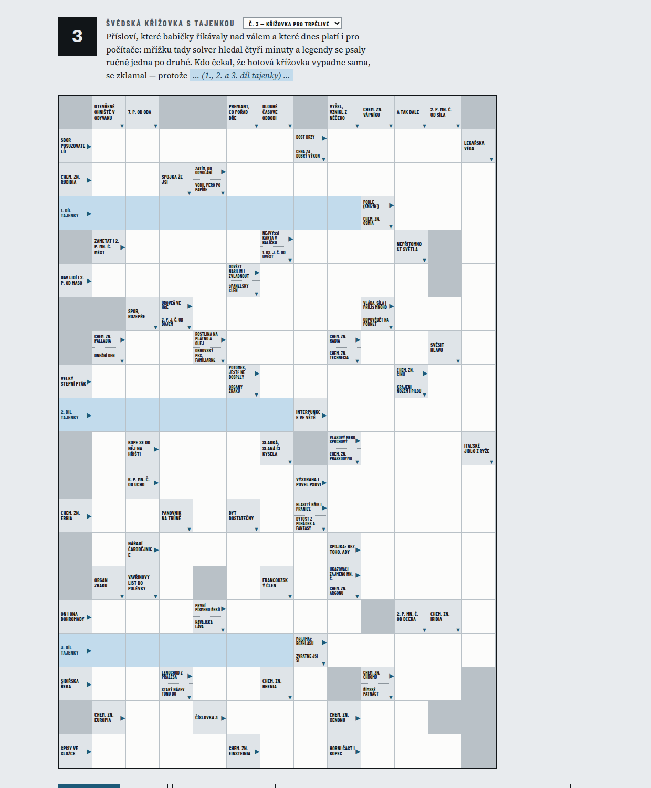

# Generátor české švédské křížovky s tajenkou

Tomáš Kapler napsal na X, že když nechá jazykové modely sestavit českou
křížovku, je to „dost tragédie" — model přece nevidí písmena, jen tokeny.
Má pravdu. Tenhle repozitář je odpověď na druhou půlku té úvahy: *„je to
o schopnosti pochopit strukturu a vytvořit si k tomu program, ale to už bych
čekal, že by mohly zvládnout."*

Tajenka první vygenerované křížovky zní **NAPSAL SI NA TO PROGRAM**.



## Co to umí

Vyrobí českou švédskou křížovku 13 × 20 s tajenkou jako **hratelnou webovou
stránku** — jeden soubor, žádný server. Luští se v prohlížeči, tiskne se na
A4, přepíná mezi hotovými křížovkami.

Tři hotové jsou v `data/puzzles/`, otevřít je lze rovnou:

```bash
xdg-open web/krizovka.html
```

## Čísla, i ta nelichotivá

| | č. 1 | č. 2 | č. 3 |
|---|---|---|---|
| slov v mřížce | 81 | 82 | 84 |
| úplné křižování | 90,7 % | 88,1 % | 87,1 % |
| vzácná slova (Pomůcka) | 16 | 0 | 0 |
| výplň (značky, zkratky) | 25 % | 23 % | 29 % |

**Křižování není úplné.** Směrnice ČSHAK v §42 žádá, aby každý znak ležel ve
dvou výrazech; u nás jich 17–22 leží jen v jednom. Striktní normě tedy ani
jedna z těch křížovek nevyhovuje.

**Čtvrtina hesel je výplň** — chemické značky, římské číslice, zeměpisné
názvy. Časopisecká křížovka jich má míň. Je to cena za to, že česká slovní
zásoba je na krátkých délkách tenká: hunspell má jen 124 dvoupísmenných
hesel.

## Setup

```bash
sudo apt install hunspell-cs          # jediná systémová závislost
git clone <repo> && cd krizovka
python3 src/make_page.py              # postaví stránku z hotových křížovek
```

Slovník i frekvenční seznam jsou v repozitáři, takže solver jde spustit
hned. Na tvorbu nové křížovky je navíc potřeba jazykový model — legendy píše
on.

## Jak vzniká nová křížovka

Postup je ve skillu [`.claude/skills/krizovka/`](.claude/skills/krizovka/SKILL.md),
v Claude Code se vyvolá jako `/krizovka`. Zabere to zhruba 20 minut, z toho
většinu psaní legend.

Práce je rozdělená tak, aby každou část dělal ten, kdo na ni má:

| část | kdo | proč |
|---|---|---|
| slovník | `build_dict.py` nad hunspellem | 132 tis. tvarů, žádné halucinace |
| pořadí slov | frekvence z titulků | aby v mřížce byla slova, která luštitel zná |
| mřížka | backtracking solver | deterministické, buď vyjde nebo ne |
| **legendy** | **jazykový model** | jediná část, kde je model doopravdy silný |
| kontrola | samostatný verifikátor | model si vlastní mřížku ověřit nemůže |

Model nikdy neskládá písmena. Skládá je program, který si model napsal — a
hotovou mřížku pak přepočítá nezávislý skript, protože sám sobě věřit nemůže.

## České konvence zadrátované do solveru

- **bez diakritiky** — `KŮŇ` se píše `KUN`; jinak se `Ý` a `Y` nikdy
  nezkříží a solver ztratí většinu možností
- **CH je jedno políčko** — je to písmeno české abecedy, takže `MNICH`
  zabere čtyři políčka, ne pět
- **legenda v mřížce** — vodorovné slovo ji má vlevo od začátku, svislé nad
  sebou; jedno políčko unese dvě
- **tajenka se pokládá první** — je to zadání, ne výsledek

## Co se cestou ukázalo

**Fill není pomalý; pomalé je poznat beznadějné mřížky.** Zaplnit dobrý vzor
trvá čtvrt sekundy, ale 84 % vzorů zaplnit nejde. Naměřeno: tři úspěchy
0,7 s, šestnáct neúspěchů 74 s. Devadesát devět procent času se dokazuje, že
se něco nedá.

**Titulkový korpus přinesl ohnuté tvary i angličtinu.** Do mřížky se dostalo
`GOT`, `OUR`, `ARE` a překlep `SVĚHO`. Korpus proto slouží jen jako řazení,
ne jako zdroj slov.

**Filtr sprostých slov nestačí.** Vypadl `ZMRD`, `VAGINA`, `ŘIŤ` — slovníkově
regulérní tvary, které žádný seznam nechytí. Řešením je `--max-rank`, který
ustřihne nefrekvenční ocas slovníku, kde tahle hesla výhradně žijí.

**Opačným směrem to nefunguje o nic líp.** Pokus zaplnit mřížku 12,9 tisíci
nejběžnějšími formami selhal 185krát ze 185 — dokud solver nezrychlil. Proto
má každá křížovka v časopise „Pomůcku".

## Struktura

```
src/build_dict.py   hunspell + frekvence -> data/words.json
src/solve.py        vzory mřížky + backtracking -> data/grid.json
src/verify.py       nezávislá kontrola; --words vypíše umístěná slova
src/make_page.py    + clues.json -> web/krizovka.html; --add do zásobníku
data/clues.json     850 ručně psaných legend, roste s každou křížovkou
data/extras.json    190 výplňových hesel s legendami
data/blacklist.txt  hesla, ke kterým legenda napsat nejde
data/puzzles/       hotové křížovky, nic se nepřepisuje
```
